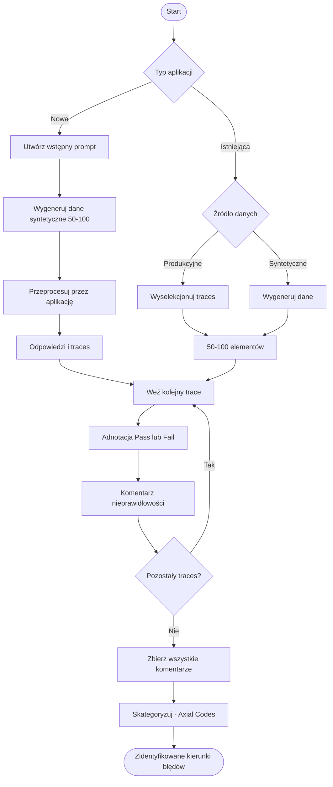

# Ewaluacja aplikacji AI - Zebrane lekcje

> Wszystko co chciałbym wiedzieć na temat ewaluacji budując aplikacje AI

---

## Spis treści

1. [Dlaczego ewaluacja jest kluczowa](#dlaczego-ewaluacja-jest-kluczowa)
2. [Ewaluacja vs Testowanie](#ewaluacja-vs-testowanie)
3. [Trzy poziomy walidacji](#trzy-poziomy-walidacji)
4. [Proces ewaluacji krok po kroku](#proces-ewaluacji-krok-po-kroku)
5. [Budowanie datasetów](#budowanie-datasetów)
6. [Analiza błędów: Open Codes i Axial Codes](#analiza-błędów-open-codes-i-axial-codes)
7. [Kiedy automatyzować ewaluację](#kiedy-automatyzować-ewaluację)
8. [Praktyka w Langfuse](#praktyka-w-langfuse)
9. [Źródła i materiały](#źródła-i-materiały)

---

## Dlaczego ewaluacja jest kluczowa

> **Ewaluacja** - proces ciągłego mierzenia wyników w celu utrzymywania, analizowania i podnoszenia jakości

Ewaluacja w kontekście aplikacji opartych o LLM jest szczególnie kluczowa ze względu na:
- **Niedeterministyczne zachowanie** dużych modeli językowych
- **Nieprzewidywalne zachowanie użytkownika**

Budując aplikację AI w sposób rzetelny i ukierunkowany, potrzebujemy podejścia łączącego praktyki z trzech obszarów:

| Obszar | Praktyki |
|--------|----------|
| **Programowanie** | Ciągłe testowanie, redefiniowanie problemu, rozbijanie na mniejsze części |
| **Budowanie produktu** | Zrozumienie użytkownika, domeny problemu, stosowanie metryk kondycji produktu |
| **Nauki społeczne** | Metodologie dla spraw niepodlegających jasnym definicjom czy standardom |

**Kluczowa myśl:** Klasyczne binarne podejście do programowania nie ma tu miejsca. Nie możemy jednoznacznie stwierdzić, że asystent czy agent jest zakończoną funkcjonalnością - możemy jedynie stwierdzić, że w dniu dzisiejszym jest skuteczny w X procentach.

> Pochodną ewaluacji jest ciągła potrzeba zrozumienia danych - czyli zrozumienia działań użytkownika oraz reagowania aplikacji na te działania.

---

## Ewaluacja vs Testowanie

> **Testowanie** ma zawsze charakter **binarny** i ma na celu zabezpieczenie przed regresją. Jest ograniczone do programistycznych walidacji - regex, słowa kluczowe, sprawdzanie formatowania.
>
> **Ewaluacja** mówi **jak dobrze** coś zadziałało, a testowanie - **czy** zadziałało.

---

## Trzy poziomy walidacji

| Poziom | Co badamy | Testowanie | Ewaluacja |
|--------|-----------|------------|-----------|
| **Black Box** | Finalna odpowiedź | Czy agent zwrócił poprawną odpowiedź? | Jak dobra jest odpowiedź? Jak wypada w porównaniu między uruchomieniami? |
| **Glass Box** | Trajektoria działania | Czy agent wywołał właściwe narzędzia we właściwej kolejności? | Jak efektywna była ścieżka? Czy wywołania narzędzi były poprawnie sformułowane? |
| **White Box** | Pojedyncza obserwacja | Czy przy tym kontekście ten pojedynczy krok dał oczekiwany wynik? | Jak dobrze model rozumuje w każdym punkcie decyzyjnym? |

---

## Proces ewaluacji krok po kroku

### Co jest potrzebne na start

1. **Aplikacja AI** - czy to pojedynczy prompt systemowy czy złożony agent ReAct
2. **Platforma do logowania** - Langfuse lub inna forma pozwalająca logować obserwacje podczas działania aplikacji

Mając tylko te dwie rzeczy, możemy rozpocząć proces doskonalenia.

### Schemat procesu

### Dla nowej aplikacji

1. **Utwórz pierwszy prompt** zgodnie z najlepszymi praktykami prompt engineeringu, z możliwie dobrym zrozumieniem domeny oraz użytkownika końcowego

2. **Wygeneruj dane syntetyczne** (50-100 elementów):
   - Oparte na analizie kierunków zapytań, gdzie aplikacja ma największe szanse na błędy
   - Zróżnicowane, obejmujące możliwie duże spektrum przypadków

   <!-- TODO: Dodać przykład takiego prompta -->

3. **Przeprocesuj każdy element** przez aplikację - otrzymasz zestaw odpowiedzi oraz ścieżek (traces)

4. **Manualna analiza każdego trace** (analiza Open Codes):
   - Dodaj binarną adnotację Pass/Fail
   - Dodaj komentarz pierwszej napotkanej nieprawidłowości (patrząc od góry)

5. **Kategoryzacja komentarzy** (analiza Axial Codes) - określasz kierunki błędów

### Dla aplikacji istniejącej

1. **Wyselekcjonuj zestaw danych** (50-100 elementów):
   - Z danych produkcyjnych (spośród dostępnych traces) LUB wygeneruj dane syntetyczne
   - Zestaw powinien wyczerpująco obejmować różnorodność zapytań użytkownika

2. **Manualna analiza każdego trace** (analiza Open Codes):
   - Dodaj binarną adnotację Pass/Fail
   - Dodaj komentarz pierwszej napotkanej nieprawidłowości

3. **Kategoryzacja komentarzy** (analiza Axial Codes)

---

## Budowanie datasetów

> **Po co budować datasety?**
> 1. Aby w kontrolowany i powtarzalny sposób dokonywać ewaluacji na wyselekcjonowanych danych obejmujących możliwie szerokie spektrum dróg aplikacji
> 2. Aby na podstawie tych danych weryfikować działanie automatycznych ewaluatorów (LLM as Judge)

**Dataset jest kluczowy aby rozpocząć jakąkolwiek ewaluację.** Może być zbudowany z danych produkcyjnych lub syntetycznych.

### Datasety mogą obejmować

**Cały trace:**
- *Input:* wszystkie dane wymagane do rozpoczęcia procesowania (w najprostszym scenariuszu - wiadomość użytkownika)
- *Output:* odpowiedź aplikacji

**Pojedynczą obserwację lub zestaw zagnieżdzonych obserwacji:**
- *Input:* wszystkie dane wymagane przez obserwację (np. dla generacji: zmienne prompta oraz wiadomości konwersacji)
- *Output:* odpowiedź LLM

> **Zasada:** Przekazuj jako input/output wszystkie dane wymagane przez fragment aplikacji oraz dane konieczne do analizy trace.

---

## Analiza błędów: Open Codes i Axial Codes

### Open Codes - obserwacja

Przejrzyj wyselekcjonowane traces, przeczytaj każdy uważnie i zanotuj **pierwszy zaobserwowany błąd** (czytając od góry) oraz oznacz jako Sukces lub Porażkę.

Definicja: [Open coding (Wikipedia)](https://en.wikipedia.org/wiki/Open_coding)

### Axial Codes - kategoryzacja

Sklasyfikuj wszystkie zanotowane błędy - z pomocą AI lub samodzielnie.
Ponownie przejrzyj traces i każdy przypisz do odpowiedniej kategorii.

Definicja: [Axial coding (Wikipedia)](https://en.wikipedia.org/wiki/Axial_coding)

---

## Kiedy automatyzować ewaluację

**Dopiero gdy:**
- Przeszliśmy parę iteracji
- Rozumiemy błędy
- Manualna ewaluacja jest zbyt kosztowna

### Dwa typy błędów

| Typ | Opis | Co robić |
|-----|------|----------|
| **Missing Instructions** | Błędy z powodu niejasnych lub niekompletnych instrukcji w prompcie (np. agent używa za dużo bullet pointów) | Najpierw napraw prompt. Tworzenie ewaluatora dla błędu, który rozwiąże prosta zmiana promptu, to często zbędny wysiłek. |
| **Model Limitations** | LLM nie działa poprawnie mimo jasnych i precyzyjnych instrukcji | **Idealni kandydaci do automatycznej ewaluacji** - reprezentują wrodzone ograniczenia modelu, nie nieporozumienie intencji. |

---

## Praktyka w Langfuse

### Trace - definicja

> **Trace** (ścieżka) - uporządkowana seria obserwacji (niektórych równoległych, innych zagnieżdżonych), pozwalająca prześledzić krok po kroku zachowanie aplikacji.

Trace jest najczęściej powiązany z sesją i użytkownikiem. Składa się z obserwacji różnego typu:
- **Events** - zdarzenia
- **Generations** - generacje
- **Tooling** - wywołania narzędzi
- **Spans** - odcinki

> **Dla chatbotów:** Traces powinny być powiązane identyfikatorem sesji/konwersacji oraz użytkownika. Trace powinien otrzymywać całą konwersację jako input, aby móc skutecznie analizować ścieżkę.

### Workflow w Langfuse

![[Attachments/AI Evals Research -  Collected/2e622fd009ba4ce84c771b15fdb1272d_MD5.jpeg]]

1. **Selekcja traces** - dodaj interesujące traces do "Annotation Queue"

2. **Konfiguracja Score Config:**
   - Potrzebujesz binarnego score config Pass-Fail
   - W miarę możliwości stawiaj na metryki binarne - łatwe do interpretacji i mniej subiektywne niż skala Likerta (1-10) czy wartości rzeczywiste (0-1)

![[Attachments/AI Evals Research -  Collected/bc7912a323a09d8d66e0983feb2a8ca5_MD5.jpeg]]

3. **Utwórz Annotation Queue:**
   - Wymagana nazwa (np. "Open Codes") oraz score config
   - *Uwaga:* Langfuse w wersji Hobby pozwala tylko na jedną kolejkę

4. **Manualna ewaluacja:**
   - Dla każdego elementu wybierz Pass lub Fail
   - Przy Fail - dodaj komentarz z pierwszą zaobserwowaną nieprawidłowością

5. **Eksport i kategoryzacja:**
   - Eksportuj traces z wynikiem Fail
   - Na podstawie komentarzy zbuduj Axial Codes

### Uwagi praktyczne

- Langfuse wyświetla na liście traces ładnie tylko JSON z polami `role` i `content` - format od Langchain jest słabo wyświetlany
- Eksperymenty przez UI to prompt eksperymenty
- Datasety przez UI są tylko do testowania promptów
- Prompty typu chat pozwalają przekazywać historię konwersacji

---

## Źródła i materiały

- [Error Analysis to Evaluate LLM Applications - Langfuse](https://langfuse.com/blog/2025-08-29-error-analysis-to-evaluate-llm-applications)
- [Automated Evaluations - Langfuse](https://langfuse.com/blog/2025-09-05-automated-evaluations)
- [Testing LLM Applications - Langfuse](https://langfuse.com/blog/2025-10-21-testing-llm-applications)
- [Synthetic Datasets Cookbook - Langfuse](https://langfuse.com/guides/cookbook/example_synthetic_datasets)
- [Experiment Interpretation - Langfuse](https://langfuse.com/blog/2025-11-06-experiment-interpretation)
- [Evals FAQ - Hamel Husain](https://hamel.dev/blog/posts/evals-faq/?ck_subscriber_id=3836412167)
