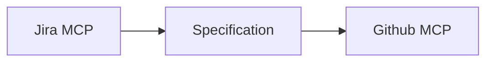

Podstawowy workflow oparty of programowanie oparte o [[Specification prompting|specyfikacje]]. Testowane wraz z [[Claude Code]], wykorzystujące [[Atlassian MCP]], [[Github MCP]] .
### Big picture

```mermaid
graph LR
    A[Jira MCP] --> B[Specification]
    B --> C[Github MCP]

```