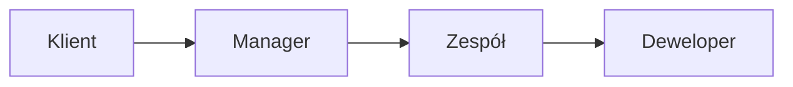
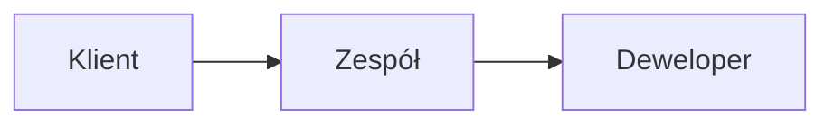
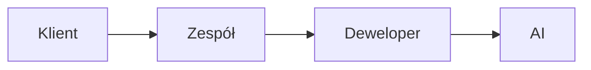
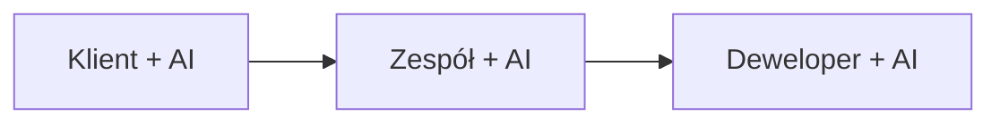

## Historyczna perspektywa

### Waterfall Era

W modelu kaskadowym informacja przepływała jednokierunkowo, często tracąc kluczowe szczegóły na każdym etapie. Przypominało to zabawę w "głuchy telefon" - im więcej pośredników, tym większe ryzyko zniekształcenia pierwotnego przekazu.

### Scrum Era

Scrum zoptymalizował przepływ wiedzy przez:
- Bezpośredni kontakt zespołu z klientem
- Regularne spotkania Sprint Planning i Review
- Product Backlog jako single source of truth

## Obecna rzeczywistość z AI

### Kluczowe wyzwania
1. **Jakość przekazu do AI**
   - Deweloper staje się "tłumaczem" między światem biznesu a AI
   - Precyzja komunikacji wpływa na jakość generowanego kodu
   - Kontekst biznesowy musi być jasno przekazany

2. **Odpowiedzialność dewelopera**
   - Weryfikacja czy AI zrozumiało wymagania
   - Zapewnienie spójności z celami biznesowymi
   - Kontrola jakości generowanych rozwiązań

## Przyszły kierunek

### Optymalizacja przepływu
- AI jako aktywny uczestnik na każdym etapie
- Szybsza iteracja pomysłów
- Lepsza dokumentacja i śledzenie decyzji

# 🎯 Zadanie

1. Przeanalizuj swój ostatni projekt:
   - Gdzie traciłeś najwięcej czasu na przekazywanie wiedzy?
   - W których miejscach AI mogłoby usprawnić komunikację?

2. Eksperyment:
   - Spróbuj opisać wymagania biznesowe do swojego następnego zadania używając różnych podejść:
     - Tradycyjny opis
     - Strukturyzowany prompt dla AI
     - Diagram lub schemat
   - Porównaj jakość kodu generowanego na podstawie każdego z tych opisów

> 💡 Pamiętaj: Jakość informacji przekazywanych do AI bezpośrednio przekłada się na jakość otrzymywanych rezultatów.
