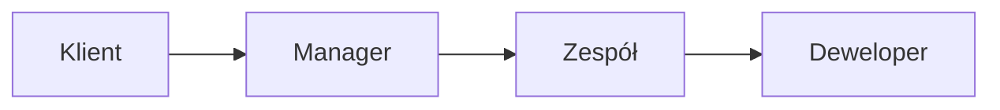
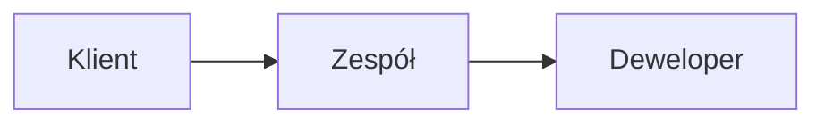
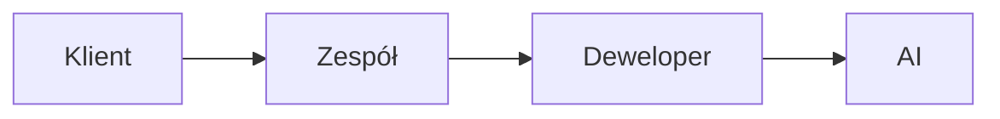
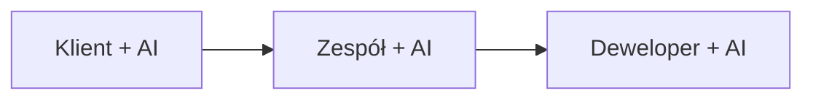

## Historyczna perspektywa

### Waterfall Era

W modelu kaskadowym informacja przepływała jednokierunkowo, często tracąc kluczowe szczegóły na każdym etapie. Przypominało to zabawę w "głuchy telefon" – im więcej pośredników, tym większe ryzyko zniekształcenia pierwotnego przekazu. W efekcie powstawały rozwiązania, które nie zawsze odpowiadały rzeczywistym potrzebom klienta.

### Scrum Era

Scrum zoptymalizował przepływ wiedzy przez:
- Bezpośredni kontakt zespołu z klientem
- Regularne spotkania Sprint Planning i Review
- Product Backlog jako single source of truth

Dzięki temu zespoły mogły szybciej reagować na zmiany, a produkty lepiej odpowiadały oczekiwaniom klientów. Jednak nadal istniały wyzwania związane z interpretacją wymagań i ich precyzyjnym przekazaniem do realizacji.

## Obecna rzeczywistość z AI

Wprowadzenie AI do procesu rozwoju oprogramowania zmienia rolę dewelopera. Nie jest już tylko wykonawcą, ale staje się tłumaczem między światem biznesu a technologią.

### Kluczowe wyzwania
1. **Jakość przekazu do AI**
   - Deweloper musi jasno i precyzyjnie formułować wymagania, aby AI mogło wygenerować wartościowy kod.
   - Kontekst biznesowy musi być jasno przekazany, aby uniknąć błędnych interpretacji.

2. **Odpowiedzialność dewelopera**
   - Weryfikacja, czy AI poprawnie zrozumiało wymagania.
   - Zapewnienie spójności generowanych rozwiązań z celami biznesowymi.
   - Kontrola jakości i bezpieczeństwa generowanego kodu.

## Przyszły kierunek

W przyszłości AI stanie się aktywnym uczestnikiem na każdym etapie procesu rozwoju oprogramowania. Zmieni to sposób, w jaki zespoły komunikują się z klientami i między sobą.

### Optymalizacja przepływu
- AI jako aktywny uczestnik na każdym etapie, wspierający zarówno klienta, jak i zespół.
- Szybsza iteracja pomysłów dzięki automatyzacji rutynowych zadań.
- Lepsza dokumentacja i śledzenie decyzji dzięki automatycznemu generowaniu zapisów rozmów i decyzji projektowych.

## 🧠 Refleksja
- Jak zmieni się rola dewelopera, gdy AI stanie się integralną częścią zespołu?
- Czy jesteśmy gotowi na współpracę z AI na równych zasadach?

# 🎯 Zadanie

1. Przeanalizuj swój ostatni projekt:
   - Gdzie traciłeś najwięcej czasu na przekazywanie wiedzy?
   - W których miejscach AI mogłoby usprawnić komunikację?

2. Eksperyment:
   - Spróbuj opisać wymagania biznesowe do swojego następnego zadania używając różnych podejść:
     - Tradycyjny opis
     - Strukturyzowany prompt dla AI
     - Diagram lub schemat
   - Porównaj jakość kodu generowanego na podstawie każdego z tych opisów.

> 💡 Pamiętaj: Jakość informacji przekazywanych do AI bezpośrednio przekłada się na jakość otrzymywanych rezultatów.
